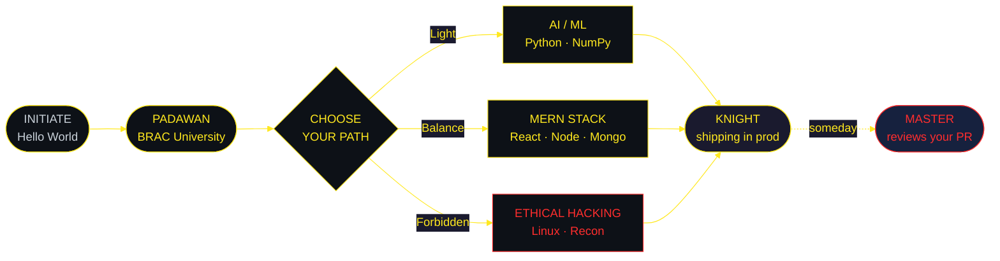
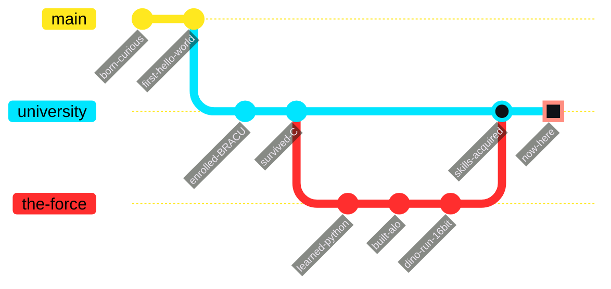

<div align="center">


<br>

<a href="https://github.com/nasablueberry?tab=followers">
  
</a>
<a href="https://github.com/nasablueberry?tab=repositories&sort=stargazers">
  
</a>


<br><br>

### `> NAVICOMPUTER // SET COURSE`

[`WHOAMI`](#-transmission-intercepted) &nbsp;•&nbsp; [`ARSENAL`](#-arsenal--loadout) &nbsp;•&nbsp; [`TRAINING TREE`](#-jedi-training-tree) &nbsp;•&nbsp; [`VOYAGES`](#-my-voyages--take-a-look) &nbsp;•&nbsp; [`DATABANK`](#-imperial-databank--stats) &nbsp;•&nbsp; [`COMMS`](#-open-a-comms-channel)

</div>

---

```console
Microsoft Windows [Version 10.0.22631.4169]
(c) Corellian Engineering Corporation. All rights reserved.

C:\Users\hemel> boot --hyperdrive --verbose

[ OK ]  mounting /dev/kyber ................................. blue
[ OK ]  loading holocron archive ........................ 7 entries
[ OK ]  calibrating navicomputer ................ Dhaka -> Coruscant
[WARN]  midi-chlorian count exceeds Padawan threshold
[FAIL]  patience.dll ................. not found (see: git commit -m "fix")

C:\Users\hemel> whoami /full
```

```python
from galaxy import Republic, TheForce


class JediEngineer(Republic):
    """Rank: Padawan  |  Affiliation: BRAC University Order"""

    CODENAME = "nasablueberry"
    HOMEWORLD = "Dhaka, Bangladesh"
    LIGHTSABER = "blue"            # crystal: kyber (Python-forged)

    holocrons = {
        "training":  ["Artificial Intelligence", "Web Development"],
        "forbidden": ["Ethical Hacking"],  # the dark side is a pathway
        "arsenal":   ["Python", "C", "JavaScript", "React", "Node.js"],
    }

    def midi_chlorian_count(self) -> int:
        return sum(len(v) for v in self.holocrons.values()) * 1_000

    def greet(self) -> str:
        return "May the source be with you."


if __name__ == "__main__":
    hemel = JediEngineer()
    print(f"> {hemel.CODENAME} @ {hemel.HOMEWORLD}")
    print(f"> midi-chlorians: {hemel.midi_chlorian_count()}")
    print(f"> {hemel.greet()}")
```

```console
> nasablueberry @ Dhaka, Bangladesh
> midi-chlorians: 7000
> May the source be with you.

C:\Users\hemel> _
```

---

## `> TRANSMISSION INTERCEPTED`

<div align="center">


</div>

> *"Code is like humor. When you have to explain it, it's bad."* — **Cory House**
>
> *"Your eyes can deceive you. Don't trust them."* — **Obi-Wan Kenobi**, on debugging by vibes

---

## `> FORCE ALIGNMENT // CALIBRATION`

<div align="center">

| Reading | Level |
|:--|:--|
| **Light Side** — writes tests, comments code |  |
| **Dark Side** — pushes to main at 3 AM |  |
| **Caffeine Saturation** |  |
| **Stack Overflow Dependency** |  |

*"It's a trap!" — every merge conflict, ever.*

</div>

---

## `> ARSENAL // LOADOUT`

<div align="center">

**Languages**

<a href="https://skillicons.dev">
  
</a>

**Frameworks & Libraries**

<a href="https://skillicons.dev">
  
</a>

**Databases & Tools**

<a href="https://skillicons.dev">
  
</a>

</div>

<br>

<details>
<summary><b><code>&gt; OPEN HOLOCRON // detailed weapon proficiency</code></b></summary>

<br>

```console
C:\Users\hemel> lightsaber --diagnostics

WEAPON            PROFICIENCY                       STATUS
─────────────────────────────────────────────────────────────
Python            ████████████████████░░░░   82%    MASTERED
JavaScript        ██████████████████░░░░░░   74%    TRAINING
C                 ████████████████░░░░░░░░   66%    TRAINING
React             █████████████████░░░░░░░   70%    TRAINING
Node.js           ███████████████░░░░░░░░░   62%    TRAINING
MongoDB           █████████████░░░░░░░░░░░   54%    PADAWAN
Ethical Hacking   ███████████░░░░░░░░░░░░░   45%    FORBIDDEN
─────────────────────────────────────────────────────────────
> 3 sabers require re-calibration. Meditate on this.
```

</details>

<details>
<summary><b><code>&gt; RESTRICTED ARCHIVE // currently learning</code></b></summary>

<br>

- 🧠 **Neural nets** — teaching sand to think, one epoch at a time
- 🕸️ **MERN in the wild** — auth, sockets, and the eternal CORS war
- 🛡️ **Ethical hacking** — breaking things *with* permission
- ☁️ **Deployment** — "but it works on my machine" is not a deploy strategy

</details>

---

## `> JEDI TRAINING TREE`



<details>
<summary><b><code>&gt; TIMELINE // the path so far</code></b></summary>

<br>



</details>

---

## `> My Voyages // take a look`

<p align="center">
  <a href="https://github.com/nasablueberry/alo">
    
  </a>
  <a href="https://github.com/nasablueberry/dino-run-16bit">
    
  </a>
</p>

<div align="center">

**`> FLEET STATUS // live telemetry`**

| Vessel | Last Signal | Mass | Traffic |
|:--|:--|:--|:--|
| `alo` |  |  |  |
| `dino-run-16bit` |  |  |  |

</div>

---

## `> IMPERIAL DATABANK // STATS`

<div align="center">


<br>


<br><br>


<br><br>


</div>

---

## `> MEDALS OF THE ORDER`

<p align="center">
  
</p>

---

## `> SARLACC PIT // CONTRIBUTION SNAKE`

<div align="center">
  <picture>
    <source media="(prefers-color-scheme: dark)" srcset="https://raw.githubusercontent.com/nasablueberry/nasablueberry/output/github-contribution-grid-snake-dark.svg"/>
    <source media="(prefers-color-scheme: light)" srcset="https://raw.githubusercontent.com/nasablueberry/nasablueberry/output/github-contribution-grid-snake.svg"/>
    
  </picture>
</div>

---

## `> HOLONET // OFF DUTY`

<div align="center">


</div>

---

<div align="center">

<details>
<summary><b>⚠️ <code>RESTRICTED // DO NOT OPEN THIS PANEL</code> ⚠️</b></summary>

<br>

<div align="left">

```console
C:\Users\hemel> ACCESS DENIED

...
...override accepted. you are persistent. i respect that.


                     |=|         |=|
                     |=|_________|=|
                     |=|  /---\  |=|
                     |=| | o o | |=|
                     |=|  \___/  |=|
                     |=|_________|=|
                     |=|         |=|

              [ TIE FIGHTER LOCKED ON YOUR SCROLLBAR ]


> You have found the secret holocron. It contains one truth:

  "It works on my machine" is a valid deployment strategy
   in exactly zero star systems.

> Reward: +1000 midi-chlorians. Go star a repo. Any repo.
```

</div>

</details>

</div>

---

## `> OPEN A COMMS CHANNEL`

<div align="center">

<a href="https://www.linkedin.com/in/hemel-ch0wdhury/">
  
</a>
<a href="mailto:hemeluddin1612602930@gmail.com">
  
</a>
<a href="https://www.instagram.com/amihemeltumike">
  
</a>
<a href="https://github.com/nasablueberry">
  
</a>

<br><br>


<br>

```console
C:\Users\hemel> shutdown /r /t 0 /c "May the Force be with you."
```

</div>


